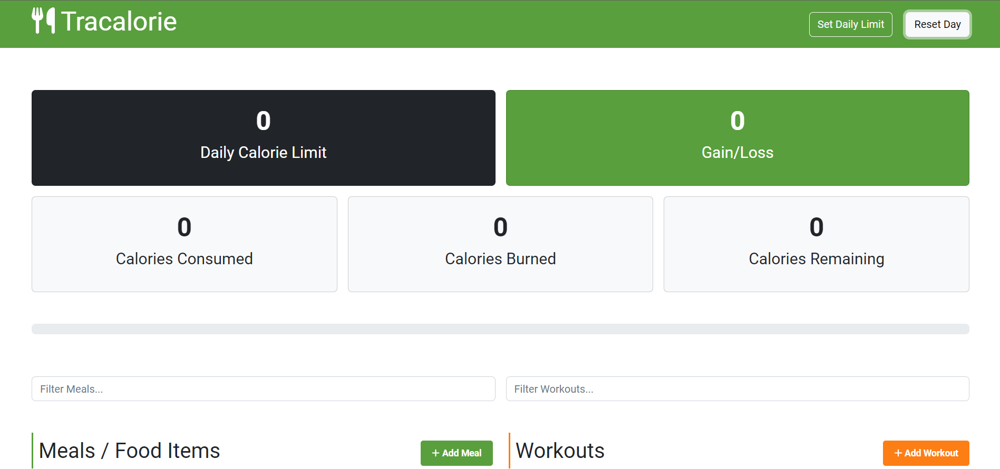
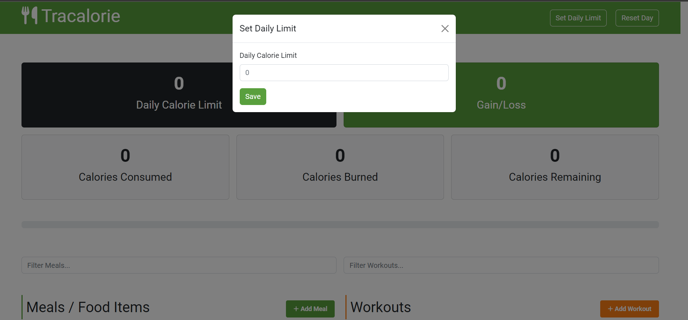
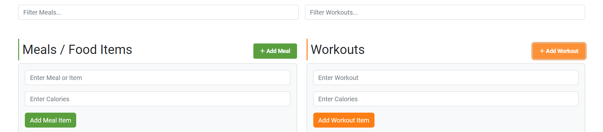
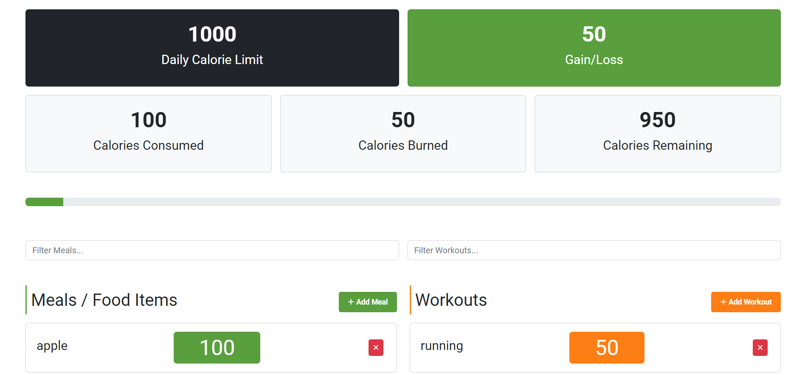
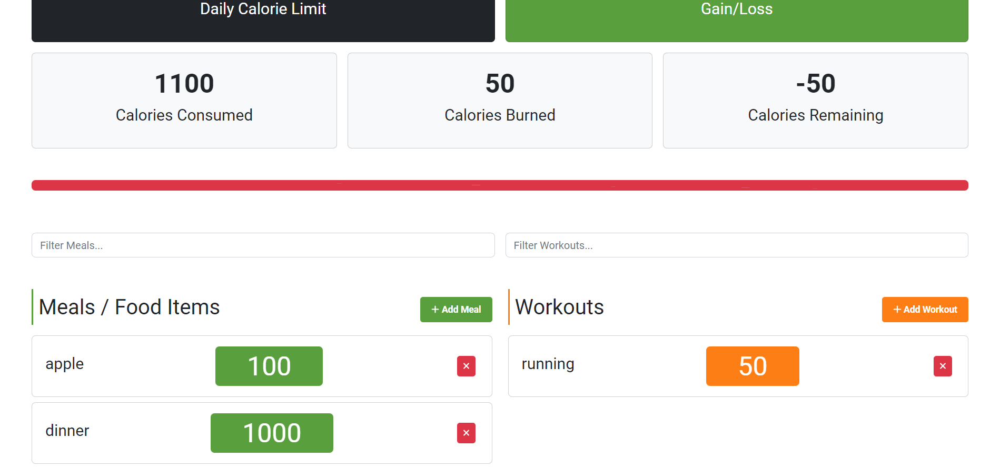

# calorieTracker-via-webpack
my calorie tracker which now is implemented in webpack | my own projects

this is a simple calorie tracker app:
you can set daily limits
add workouts and meals ex...
and track consumed and burned calories

this project is implemented using raw javascript, bootstrap templete
and it is oop based too.
i have used localstorage of browser as temproray database

## main page

## setting calorie

## adding meals and workouts:
### filter and adding meal

### meals and workouts and progressbar

